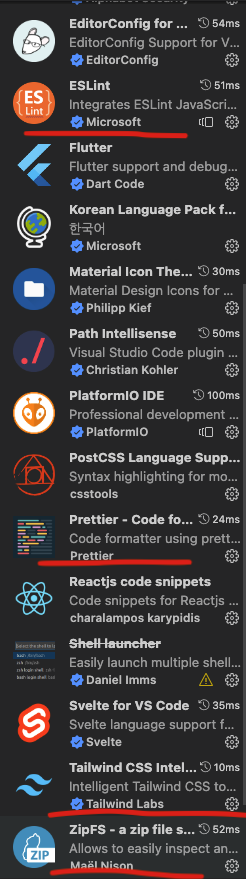

# 달밤 프론트에 오신걸 환영합니다.

**포트폴리오를 위한 프로젝트입니다.**

## install

**설치물 extentions**

prettier

ZipFS

Tailwind CSS IntelliSense

ESLint



## Start

터미널에서 아래먼저 쳐서 local 환경을 맞추고

```
  yarn setup
```

local server 올림

```
  yarn dev
```

Tailwind를 동적으로 실시간 보면서 코딩하고싶다 하면 아래

```
  yarn dev:tailwind
```

Storybook 사용

```
  yarn storybook
```

나머지는 package.json의 스크립트 참고하세요

## reference

nextjs 13

typescript

yarn berry pnp zero install

node version v19.2.0

tailwindcss

storybook
